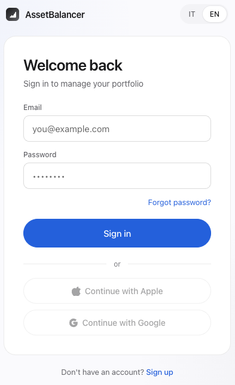
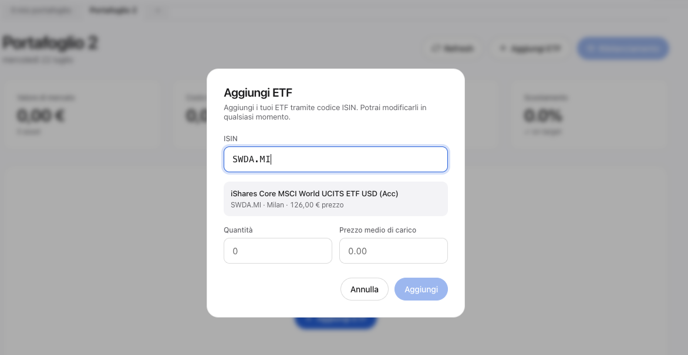
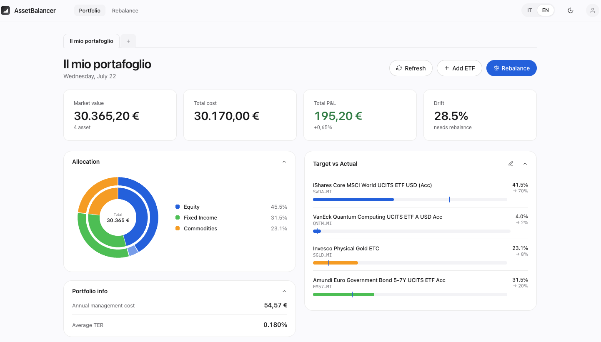
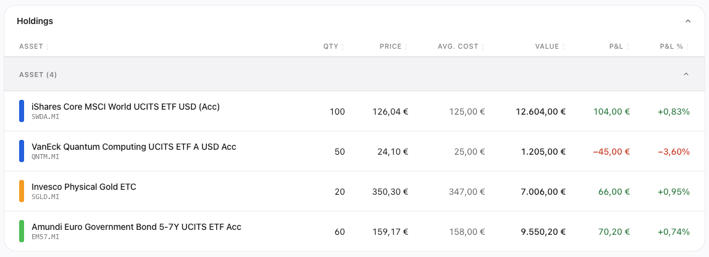
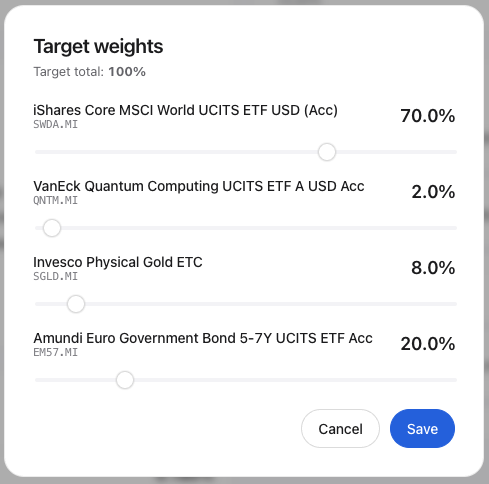
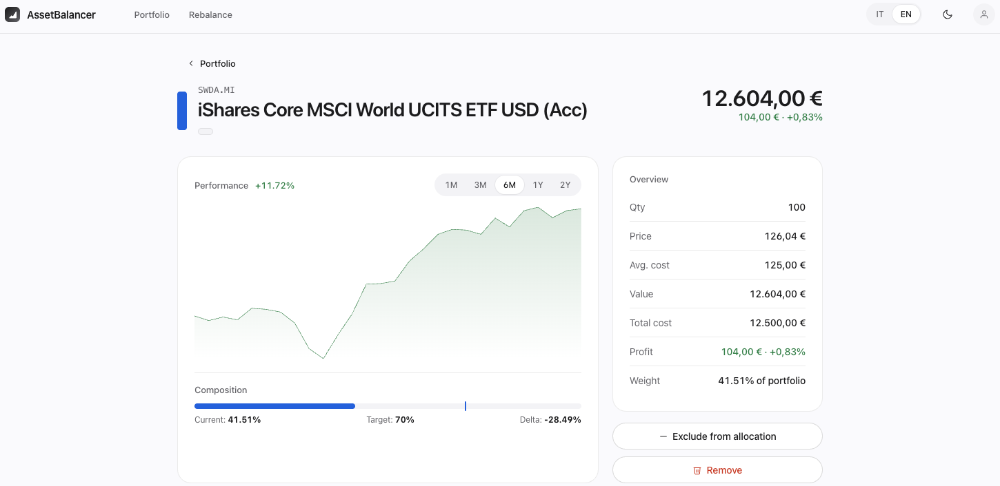
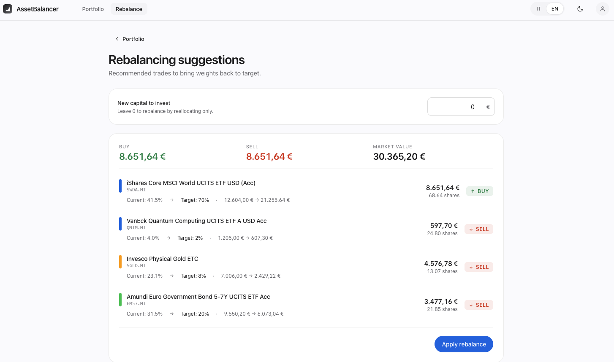
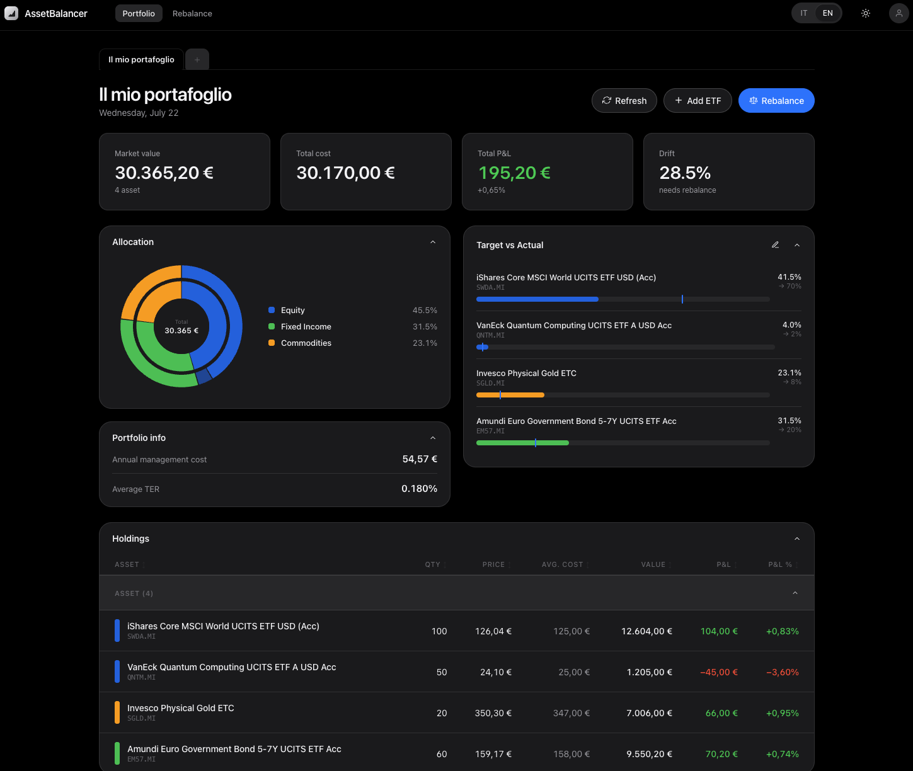

# AssetBalancer

A self-hosted portfolio tracker for multi-asset investing. Add your ETFs by ISIN, track live prices pulled from Yahoo Finance and normalized to EUR, set target allocations, and get concrete buy/sell suggestions to rebalance your portfolio.

Built as a full-stack project: React frontend, an Express backend-for-frontend, and PostgreSQL for persistence — all containerized with Docker.

## Features

### Authentication

Email/password signup and login, with short-lived JWT access tokens and rotating refresh tokens for persistent sessions.




### Add holdings by ISIN

Search any ETF by its ISIN code — AssetBalancer resolves it against Yahoo Finance, preferring EUR-listed exchanges when available, and shows the current price before you confirm quantity and average cost.



### Portfolio dashboard

At a glance: total market value, total cost, absolute P&L, and how far the portfolio has drifted from its target weights. An allocation donut chart breaks the portfolio down by macro asset class.



### Positions table

Every holding with quantity, live price, average cost, market value, and P&L — both absolute and percentage, color-coded green/red.



### Target allocation & drift tracking

Set a target weight per asset (down to one decimal place) and see in real time how the current allocation compares, with the drift highlighted per position. Assets can be excluded from allocation calculations (e.g. cash-like holdings) without removing them from the portfolio.




### Rebalancing suggestions

Given the current allocation and target weights, AssetBalancer computes exactly what to buy and sell — in currency and in shares — to bring the portfolio back on target, optionally accounting for new capital you want to invest.



### Multi-portfolio support

Track several portfolios side by side (e.g. personal vs. retirement) as separate tabs, each with its own holdings and targets.

### Light & dark theme

Full UI theming, switchable at any time.



### Multi-currency, normalized to EUR

All prices are converted to EUR using live FX rates from Yahoo Finance (cached for 5 minutes), including GBp (pence) → GBP → EUR conversion for London-listed ETFs.

## Tech stack

| Layer    | Technology                          |
|----------|--------------------------------------|
| Frontend | React + Vite, served by Nginx        |
| Backend  | Express (Node.js), backend-for-frontend pattern |
| Database | PostgreSQL 16                        |
| Data     | Yahoo Finance API (quotes, search, FX rates) |
| Infra    | Docker Compose                       |

## Architecture

```
Browser → frontend:80 (Nginx) → beff:3001 (Express) → PostgreSQL 16
                                       ↓
                                Yahoo Finance API
```

Nginx handles SPA routing and proxies `/api/*` and `/auth/*` to the backend — there's no direct browser-to-backend traffic.

## Running locally

```bash
cp .env.example .env      # fill in POSTGRES_PASSWORD and JWT_SECRET
docker compose up --build
# → http://localhost:8080
```
