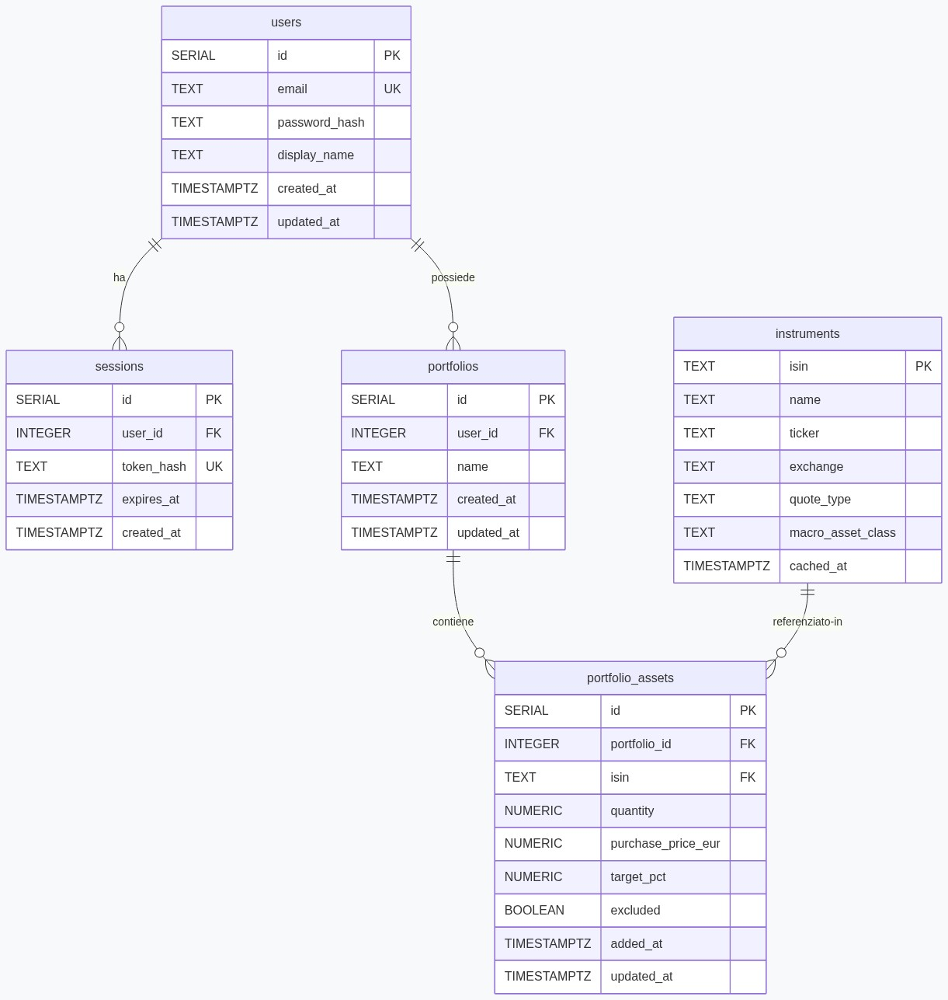
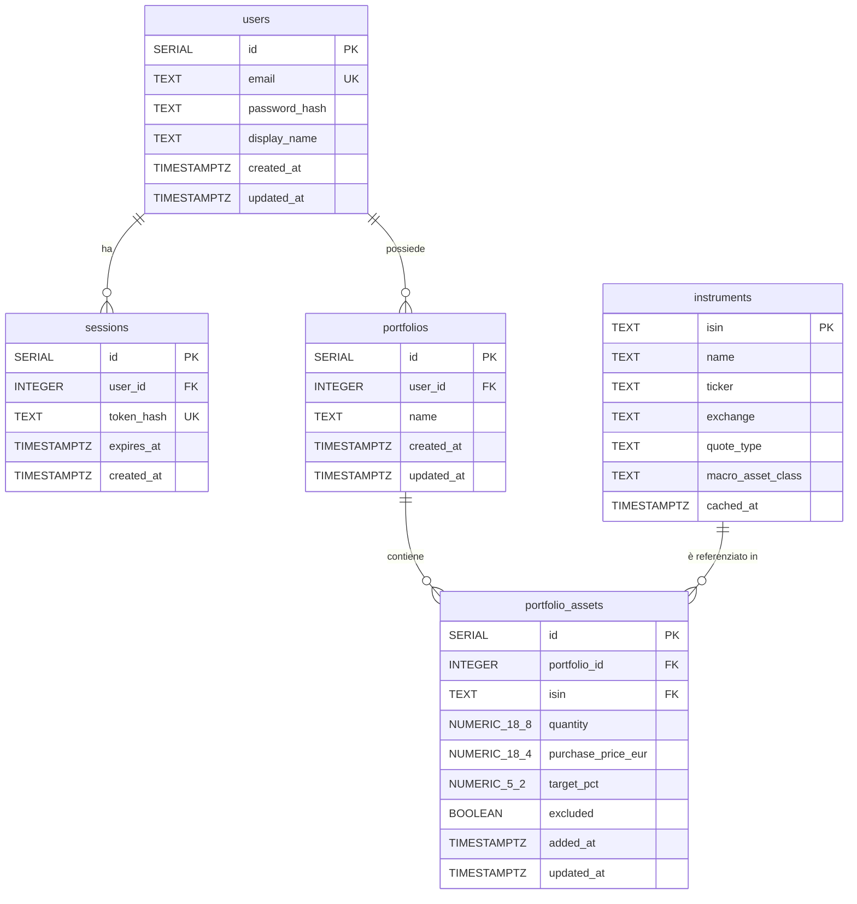

# Database Schema — AssetBalancer

## Schema ER

Sorgente Mermaid

---

## Tabelle

### `users`
Credenziali e profilo degli utenti registrati. La password non viene mai salvata in chiaro.

| Campo           | Tipo         | Vincoli            | Descrizione                                  |
|-----------------|--------------|--------------------|----------------------------------------------|
| `id`            | `SERIAL`     | `PK`               | Identificativo univoco auto-incrementale     |
| `email`         | `TEXT`       | `NOT NULL UNIQUE`  | Indirizzo email, usato come username         |
| `password_hash` | `TEXT`       | `NOT NULL`         | Hash bcrypt della password (mai in chiaro)   |
| `display_name`  | `TEXT`       | —                  | Nome visualizzato, opzionale                 |
| `created_at`    | `TIMESTAMPTZ`| `NOT NULL DEFAULT NOW()` | Data di registrazione                  |
| `updated_at`    | `TIMESTAMPTZ`| `NOT NULL DEFAULT NOW()` | Aggiornato automaticamente da trigger  |

---

### `sessions`
Una riga per ogni refresh-token emesso. Permette la revoca esplicita delle sessioni. Gli access token (JWT) sono stateless e non vengono salvati.

| Campo        | Tipo         | Vincoli                        | Descrizione                                              |
|--------------|--------------|--------------------------------|----------------------------------------------------------|
| `id`         | `SERIAL`     | `PK`                           | Identificativo univoco auto-incrementale                |
| `user_id`    | `INTEGER`    | `NOT NULL FK→users ON DELETE CASCADE` | Utente proprietario della sessione             |
| `token_hash` | `TEXT`       | `NOT NULL UNIQUE`              | SHA-256 del refresh token (mai il token in chiaro)      |
| `expires_at` | `TIMESTAMPTZ`| `NOT NULL`                     | Scadenza del refresh token                              |
| `created_at` | `TIMESTAMPTZ`| `NOT NULL DEFAULT NOW()`       | Data di emissione                                       |

**Indici:** `user_id`, `expires_at`

---

### `instruments`
Cache normalizzata dei metadati degli strumenti finanziari ottenuti da Yahoo Finance. I dati di un instrument sono condivisi tra tutti i portafogli che lo contengono (3NF).

| Campo               | Tipo         | Vincoli        | Descrizione                                                                 |
|---------------------|--------------|----------------|-----------------------------------------------------------------------------|
| `isin`              | `TEXT`       | `PK`           | Codice ISIN (chiave naturale univoca dello strumento)                       |
| `name`              | `TEXT`       | —              | Nome completo dello strumento                                               |
| `ticker`            | `TEXT`       | —              | Simbolo di borsa (es. `SWDA`, `CSPX`)                                       |
| `exchange`          | `TEXT`       | —              | Borsa di quotazione (es. `Milan`, `XETRA`)                                  |
| `quote_type`        | `TEXT`       | —              | Tipo strumento da Yahoo Finance (`ETF`, `EQUITY`, `MUTUALFUND`, `CRYPTOCURRENCY`, …) |
| `macro_asset_class` | `TEXT`       | —              | Macro classe di appartenenza: `Equity`, `Fixed Income`, `Cash & Cash Equivalents`, `Commodities`, `Real Estate`, `Crypto & Digital Assets`, `Alternative Investments` |
| `cached_at`         | `TIMESTAMPTZ`| `NOT NULL DEFAULT NOW()` | Timestamp dell'ultimo aggiornamento da Yahoo Finance          |

---

### `portfolios`
Ogni utente può possedere più portafogli.

| Campo        | Tipo         | Vincoli                              | Descrizione                                  |
|--------------|--------------|--------------------------------------|----------------------------------------------|
| `id`         | `SERIAL`     | `PK`                                 | Identificativo univoco auto-incrementale     |
| `user_id`    | `INTEGER`    | `NOT NULL FK→users ON DELETE CASCADE`| Utente proprietario del portafoglio          |
| `name`       | `TEXT`       | `NOT NULL`                           | Nome del portafoglio                         |
| `created_at` | `TIMESTAMPTZ`| `NOT NULL DEFAULT NOW()`             | Data di creazione                            |
| `updated_at` | `TIMESTAMPTZ`| `NOT NULL DEFAULT NOW()`             | Aggiornato automaticamente da trigger        |

**Indici:** `user_id`

---

### `portfolio_assets`
Associazione tra un portafoglio e uno strumento finanziario. Contiene i dati di posizione specifici dell'utente (quantità, prezzo di carico, peso target). Il vincolo `UNIQUE(portfolio_id, isin)` impedisce duplicati nello stesso portafoglio.

| Campo               | Tipo            | Vincoli                                    | Descrizione                                                    |
|---------------------|-----------------|--------------------------------------------|----------------------------------------------------------------|
| `id`                | `SERIAL`        | `PK`                                       | Identificativo univoco auto-incrementale                      |
| `portfolio_id`      | `INTEGER`       | `NOT NULL FK→portfolios ON DELETE CASCADE` | Portafoglio di appartenenza                                   |
| `isin`              | `TEXT`          | `NOT NULL FK→instruments`                  | Strumento finanziario referenziato                            |
| `quantity`          | `NUMERIC(18,8)` | `NOT NULL`                                 | Numero di quote/azioni possedute                              |
| `purchase_price_eur`| `NUMERIC(18,4)` | —                                          | Prezzo medio di carico in EUR (null se non inserito)          |
| `target_pct`        | `NUMERIC(5,2)`  | `NOT NULL DEFAULT 0`                       | Peso target dell'asset nel portafoglio (in percentuale)       |
| `excluded`          | `BOOLEAN`       | `NOT NULL DEFAULT FALSE`                   | Se `true`, l'asset è escluso dal calcolo dell'allocazione     |
| `added_at`          | `TIMESTAMPTZ`   | `NOT NULL DEFAULT NOW()`                   | Data di aggiunta al portafoglio                               |
| `updated_at`        | `TIMESTAMPTZ`   | `NOT NULL DEFAULT NOW()`                   | Aggiornato automaticamente da trigger                         |

**Vincolo univoco:** `(portfolio_id, isin)`  
**Indici:** `portfolio_id`, `isin`

---

## Trigger

| Trigger                      | Tabella            | Evento          | Effetto                                      |
|------------------------------|--------------------|-----------------|----------------------------------------------|
| `users_updated_at`           | `users`            | `BEFORE UPDATE` | Imposta `updated_at = NOW()`                 |
| `portfolios_updated_at`      | `portfolios`       | `BEFORE UPDATE` | Imposta `updated_at = NOW()`                 |
| `portfolio_assets_updated_at`| `portfolio_assets` | `BEFORE UPDATE` | Imposta `updated_at = NOW()`                 |
